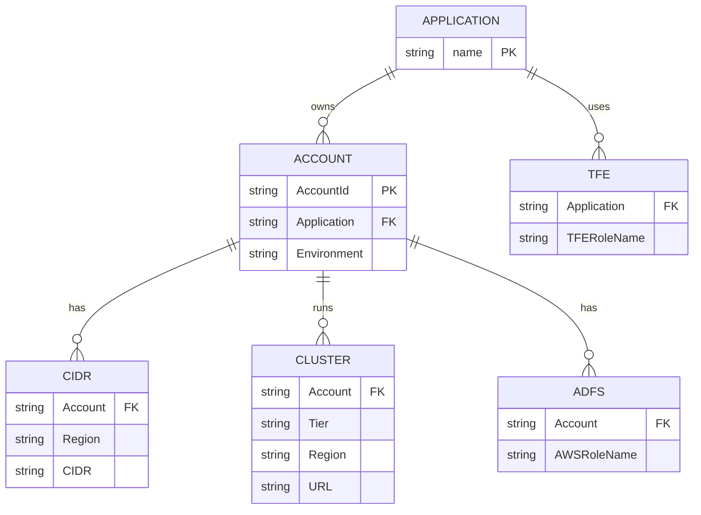

# AWS Cloud Environment Dashboard

An interactive dashboard for visualizing AWS cloud environment data including accounts, CIDR allocations, EKS clusters, ADFS roles, and TFE roles.

## Data Models

### Account
| Field | Description |
|-------|-------------|
| AccountId | 11-digit AWS account ID |
| Application | Application name (APP1, APP2, TEAM3...) |
| Environment | Environment type (DEV, UAT, RTB, PROD) |

### CIDR
| Field | Description |
|-------|-------------|
| Account | AWS account ID |
| Region | AWS region (eu-west-1, eu-west-2) |
| CIDR | CIDR block notation |

### Cluster
| Field | Description |
|-------|-------------|
| Account | AWS account ID |
| Tier | Cluster tier (tadpole, andromeda, sit01, medusa...) |
| Region | AWS region |
| URL | Link to AWS EKS Console |

### ADFS
| Field | Description |
|-------|-------------|
| Account | AWS account ID |
| AWSRoleName | IAM role name from ADFS |

### TFE
| Field | Description |
|-------|-------------|
| Application | Application name |
| TFE Role Name | Terraform Enterprise role name |

## Data Model Relations



## Quick Start

### Without Docker

```bash
# Start a local HTTP server
python -m http.server 8000

# Open browser
open http://localhost:8000
```

### With Docker

```bash
# Build the image
docker build -t cloud-dashboard .

# Run the container
docker run -p 8080:80 cloud-dashboard

# Open browser
open http://localhost:8080
```

## Features

- **Global Filters**: Filter data by Application, Environment, and Region
- **Interactive Tables**: Sortable, searchable DataTables with pagination
- **Responsive Design**: Works on desktop and mobile devices
- **CSV Data**: Easy to edit CSV files in `data/` directory

## Project Structure

```
.
├── data/
│   ├── account.csv
│   ├── cidr.csv
│   ├── cluster.csv
│   ├── adfs.csv
│   └── tfe.csv
├── css/
│   └── styles.css
├── js/
│   └── app.js
├── index.html
├── Dockerfile
└── README.md
```
